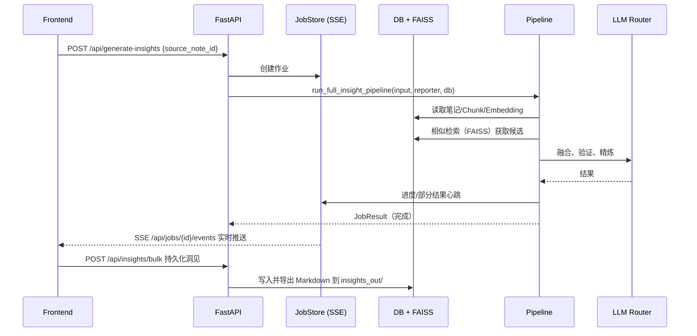

# Synapse 架构总览 (Architecture Overview)

本文概述当前 Synapse 的整体架构与数据流，并附带 Mermaid 图帮助快速理解组件关系与交互方式。

## 架构图（Mermaid）

```mermaid
graph TB
  %% Frontend
  subgraph "Frontend (React/Vite)"
    FE_UI[UI 组件<br/>src/components/*]
    FE_STATE[客户端状态<br/>src/lib/store.ts]
    FE_API[API 封装<br/>src/lib/api/*]
  end

  %% Backend
  subgraph "Backend (FastAPI)"
    APP[server.py<br/>FastAPI 应用]
    ROUTERS[/API 路由集合<br/>src/api/*/]
    JOBS[作业与SSE<br/>/api/jobs/*]
    PIPE[洞见流水线入口<br/>src/backend_pipeline.py]
    AS_PIPE[AgentScope 流水线<br/>src/agentscope_app/flow/pipeline.py]
    LEGACY[Legacy RAG/排序/演化<br/>src/eureka_rag/* + src/backend/*]
    EMB[Embedding 服务<br/>src/services/embedding_service.py]
    VI[向量索引管理 (FAISS)<br/>src/services/vector_index_manager.py]
    FSYNC[文件同步/导出<br/>src/services/filesync.py]
    LLM[LLM 路由<br/>src/synapse/config/llm.py]
  end

  %% Storage
  subgraph "存储"
    DB[(SQLite/SQLAlchemy<br/>synapse.db)]
    INDEX[(FAISS 索引 + id_mapping.json)]
    VAULT[(本地笔记目录 vault/)]
    OUT[(洞见导出目录 insights_out/)]
  end

  %% External
  subgraph "外部服务（可选）"
    GATEWAY[[Vercel AI Gateway]]
    GEMINI[[Google GenAI (Gemini)]]
    HF[[HuggingFace Inference]]
    SERP[[SerpAPI Web Search]]
    ASCOPE[[AgentScope Studio/Tracing]]
  end

  %% Edges
  FE_UI -->|REST + SSE| APP
  FE_API -->|/api/*| ROUTERS
  APP --> ROUTERS
  ROUTERS --> DB
  DB --- DB
  ROUTERS --> EMB
  EMB --> VI
  VI --> INDEX
  ROUTERS --> JOBS
  JOBS -->|/api/jobs/{id}/events| FE_UI
  ROUTERS --> LLM
  LLM -->|优先| GATEWAY
  LLM -->|回退| GEMINI
  LLM -->|可选| HF
  ROUTERS --> FSYNC
  FSYNC --> DB
  FSYNC --> EMB
  FSYNC --> VAULT
  FSYNC --> OUT
  ROUTERS --> PIPE
  PIPE --> AS_PIPE
  PIPE -. 失败回退 .-> LEGACY
  AS_PIPE --> LLM
  LEGACY --> LLM
  DB --> DB
  INDEX --> INDEX
  AS_PIPE -. 观测 .-> ASCOPE
```

## 主要组件

- 前端（React/TypeScript）: 负责笔记/洞见的展示与交互，通过 REST 与 SSE 与后端通信。
  - 代码位置：`src/components`、`src/lib`、`src/context`
- 后端（Python/FastAPI）: 统一的 API 服务、作业编排、洞见流水线入口、文件同步与导出。
  - 应用入口：`server.py`（挂载路由、CORS、生命周期管理、后台任务）
  - 路由：`src/api`（notes/search/imports/llm/insights/filesync/yaotong/chunks/metrics/jobs）
- 数据库（SQLite + SQLAlchemy Async）: 持久化笔记、Chunk、Embedding、Insight。
  - 位置：`src/database/*`，默认文件 `synapse.db`
- 向量检索（FAISS）: 由 `VectorIndexManager` 管理的本地索引与 ID 映射文件，支持相似 Chunk 搜索与候选检索。
  - 位置：`src/services/vector_index_manager.py`
- Embedding 服务: 负责按笔记内容分段、生成向量、写回 DB 与 FAISS。
  - 位置：`src/services/embedding_service.py`（调用 `src/util/genai_compat.py`，支持本地 fake 向量用于测试）
- 洞见流水线: 对接 AgentScope 风格的编排（候选挖掘、融合排序、验证与精炼），保留 Legacy 回退。
  - 入口：`src/backend_pipeline.py`
  - 新版：`src/agentscope_app/flow/pipeline.py` + `agents/*` + `tools/*`
  - 旧版：`src/eureka_rag/*`、`src/backend/ranking.py`、`src/backend/refinement.py`
- LLM 路由：集中式任务到模型映射与调用路由，优先 Vercel AI Gateway，回退到 Google/HF，亦可走 AgentScope ChatModel。
  - 位置：`src/synapse/config/llm.py`
- 文件同步/导出：监听/导入本地笔记目录（vault/），洞见导出为 Markdown（insights_out/）。
  - 位置：`src/services/filesync.py` + `src/api/filesync_routes.py`
- 作业与进度（SSE）：`/api/jobs/*` 提供作业状态与事件流，前端展示逐步进度。
  - 位置：`src/jobs.py`

## 关键数据流

### 笔记 CRUD 与向量化

1) 前端调用 `/api/notes` 创建/更新/删除笔记。
2) 后端写 DB；创建/更新时触发分段与 Embedding，更新 FAISS 索引；删除时从索引移除相关向量。
3) 前端刷新列表或状态。

### 洞见生成（作业 + 编排）



## AgentScope 编排与回退

- 兼容层：`src/backend_pipeline.py` 暴露 `run_full_insight_pipeline`；优先调用 `src/agentscope_app/flow/pipeline.py`，失败时回退到 Legacy 管线。
- Agent 组件：
  - 候选挖掘：`src/agentscope_app/agents/candidate_miner.py`
  - 融合与打分：`src/agentscope_app/agents/fusion_crucible.py`
  - 验证与精炼：`src/agentscope_app/agents/verifier.py`
- 工具：
  - FAISS 封装：`src/agentscope_app/tools/faiss_store.py`
  - Web 检索（SerpAPI）：`src/agentscope_app/tools/web_search.py`
- 观测/追踪（可选）：配置 `AGENTSCOPE_STUDIO_URL` / `AGENTSCOPE_TRACING_URL` 后启用；否则装饰器为 no-op。

## 环境变量与配置

- LLM 网关（优先）：`VERCEL_AI_GATEWAY_URL`, `VERCEL_AI_GATEWAY_TOKEN`
- Google：`GOOGLE_API_KEY` 或 `GEMINI_API_KEY`
- HuggingFace（可选）：`HF_API_TOKEN`, `HF_TEXT_MODEL`
- Web 搜索（可选）：`SERPAPI_API_KEY`
- AgentScope（可选）：`AGENTSCOPE_STUDIO_URL`, `AGENTSCOPE_TRACING_URL`
- 向量索引存储：`SYNAPSE_DATA_DIR`, `VECTOR_INDEX_PATH`, `VECTOR_ID_MAPPING_PATH`
- 文件同步：`NOTES_DIR`（默认 `vault/`）, `INSIGHTS_DIR`（默认 `insights_out/`）, `NOTES_WATCH_INTERVAL_SEC`
- 测试/开发：`EMBEDDINGS_FAKE=1` 可启用本地伪向量

## 运行手册（Runbook）

- Windows 激活虚拟环境（如需）：`synapse0.15-codex\venv\Scripts\activate`
- 设置环境变量（见上）
- 启动后端：`uvicorn server:app --host 127.0.0.1 --port 8000 --reload`
- 健康检查：`GET /api/health` 返回已配置能力（LLM/Gateway/SerpAPI/AgentScope）

## 回退策略

- AgentScope 未安装/未配置：`src/agentscope_app/telemetry.py` 为 no-op 装饰器；流水线自动回退到 Legacy 实现。
- LLM 路由：优先 AgentScope ChatModel → Vercel AI Gateway → HuggingFace（轻量任务）→ Google（直接调用）。
- 外部搜索缺失：`SERPAPI_API_KEY` 未配置时，验证降级但流水线不中断。

以上即当前架构与关键路径摘要，若模块路径或行为更新，请同步维护本文件中的图与链接。

